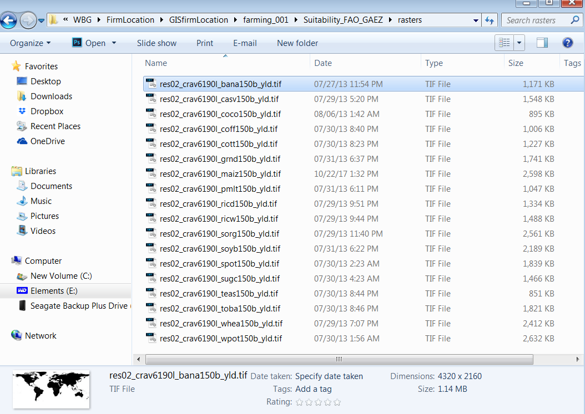

# Zonal stats of crop suitability rasters

### Purpose
This python script uses arcpy to calculate zonal statistics of  several crop suitability rasters for subcounties in Uganda. The script can be modify to calculate crop suitability zonal stats for any number of crops (as rasters files) and any region.

The crop suitability rasters were downloaded from the [FAO GAEZ data portal](http://gaez.fao.org/). The script also requires a shapefile for the spatial units of interest. In this case it is Uganda's subcounties.

In this case, 19 different rasters representing the suitability for different crops are placed in the same folder. The raw rasters cover the entire globe. The script first converts a shapefile of Ugandan subcounties into a raster. It then clips all crop rasters to the country of Uganda and finally runs the zonal stats. Lastly, it converts the output to csv files for easy import into stats software.

Name of script: [Zonal_stats_Crop_Suitability.py](Zonal_stats_Crop_Suitability.py)

### Script explanation
*OBS. Always set the path according to your own directory.*

Import the modules.
```python
import arcpy, os
from arcpy import env
```
Set the environment workspace to the folder containing all the rasters. Print out to make sure it's the correct folder.
```python
env.workspace = r"E:\WBG\FirmLocation\GISfirmLocation\farming_001\Suitability_FAO_GAEZ\rasters"
print arcpy.env.workspace
```
Make it possible to overwrite stuff and checkout Spatial Analyst extension.
```python
arcpy.env.overwriteOutput = True
arcpy.CheckOutExtension("Spatial")
print 'Check out extension complete'
```
Define and list the rasters in the folder to make sure they are all there.
```python
rasters = arcpy.ListRasters()
print arcpy.ListRasters()
```
Convert the Uganda subcounty shapefile (**NewUnit**) into raster format. (This is the best way to calculate zonal stats when you have tiny spatial features. If a subcounty shapefile is used for the zonal stats, the tool doesn't run the calculations for some of the smaller subcounties). The unique subcounty ID field is 'newUnitID'. Use a relatively small output cell size (0.01) since this will make sure the inclusion of all subcounties in the zonal stats calculations. Place the output raster in desired directory. A new raster called **newUnitRas001** is created and defined as **newUnitRas**.
```python
NewUnit = r"E:/WBG/FirmLocation/Uganda/UgandaGIS/gis_data/Environment/LessFavoredAgLand/newUnitPop_LFAL_WGS.shp"
arcpy.FeatureToRaster_conversion(in_features=NewUnit, field="newUnitID", out_raster="E:/WBG/FirmLocation/Uganda/UgandaGIS/gis_data/Environment/LessFavoredAgLand/newUnitRas001", cell_size="0.01")
NewUnitRas ="E:/WBG/FirmLocation/Uganda/UgandaGIS/gis_data/Environment/LessFavoredAgLand/newUnitRas001"
```
Use a Uganda country shapefile to define the clip extent (the subcounty shapefile might as well have been used here).

```python
UgandaCountry = "E:/WBG/FirmLocation/Uganda/UgandaGIS/UgandaCountry.shp"
```
The loop below does the following:
1. Clips all rasters in the working directory folder to Uganda. Since the original raster names are very long (eg. *res02_crav6190l_bana150b_yld.tif* for banana) the output names need to be shorter for arcpy to accept it in later steps. First the extension is taken out of the name, then the name is split into parts at each underscore, then the 3 part ([2]) is used as the crop name since it contains the name of the actual crop (eg. *bana150b*). Define each newly clipped raster with shorter name as **crop**.
2. Resample the crop rasters so that the cell size matches the uganda subcounty cell size (0.01 dd).
3. Run zonal stats tool.
4. Convert the zonal stats output table to csv files.

```python
for raster in rasters:
    clipoutraster = r"E:\WBG\FirmLocation\Uganda\UgandaGIS\gis_data\Environment\cropSuitability_FAOGAEZ/Ug"+raster
    arcpy.Clip_management(in_raster=raster, rectangle="28.801 -1.698 35.552 4.477", out_raster=clipoutraster, in_template_dataset=UgandaCountry, nodata_value="#", clipping_geometry="NONE", maintain_clipping_extent="NO_MAINTAIN_EXTENT")
    raster_name = os.path.basename(raster).rstrip(os.path.splitext(raster)[1])
    rasterNameParts = raster_name.split('_') #make name shorter, only use this part since it contains the crop name
    print rasterNameParts[2] #print to make sure the output name is what I want it to be
    crop = rasterNameParts[2]
    resampleoutraster = r"E:/WBG/FirmLocation/Uganda/UgandaGIS/gis_data/Environment/cropSuitability_FAOGAEZ/"+crop+"_001.tif" #define outraster
    arcpy.Resample_management(in_raster=clipoutraster, out_raster=resampleoutraster, cell_size="0.01", resampling_type="NEAREST") #change resolution to match NewUnitRas
    print "resample %s done" % (crop)
    zonalouttable = "E:/WBG/FirmLocation/Uganda/UgandaGIS/gis_data/Environment/cropSuitability_FAOGAEZ/"+crop+"_zonal" #define location and name of output table
    arcpy.gp.ZonalStatisticsAsTable_sa(NewUnitRas, "VALUE", resampleoutraster, zonalouttable, "DATA", "MEAN") #zonal stats
    outLocation = "E:/WBG/FirmLocation/Uganda/UgandaGIS/gis_data/Environment/cropSuitability_FAOGAEZ/" #define output location for csv file
    print "zonal stats %s done" % (crop)
    arcpy.TableToTable_conversion(in_rows=zonalouttable, out_path=outLocation, out_name=crop+"_zonaltbl.csv") #convert output table to csv file
```
Print message when done and check in the Spatial Analyst extension (important if you are sharing the extension with many users.)
```python
print 'Complete'
arcpy.CheckInExtension("Spatial")
```

### Screenshots
Screenshot of folder containing the raw rasters:


Screenshot of folder containing output tifs and csv files:

