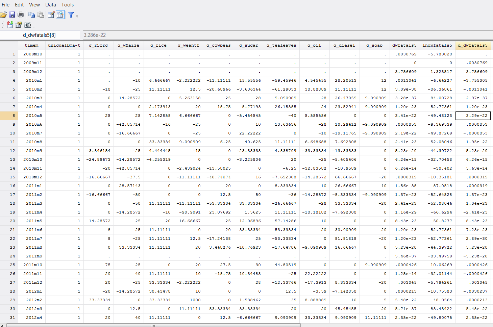
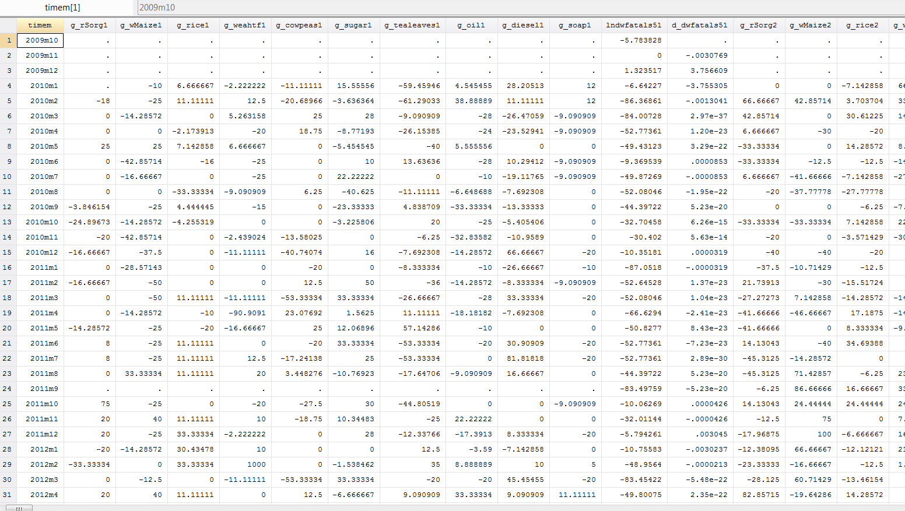
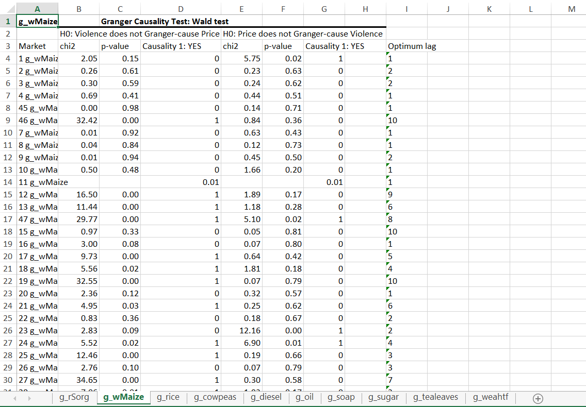

# Granger Causality test on panel data for each panel

### Purpose
These do scripts perform multiple Granger Causality tests using loops in Stata. We start off with a panel dataset of monthly prices for multiple products in multiple markets and a variable indicating monthly exposure to violent conflicts per market (in Somalia). The script tests the direction of Granger-causality between violence and all markets and products. It also writes the output to an excel file using putexcel.

### Script explanation
*OBS. Always set the path according to your own directory.*

##### Script 1: [long_to_wide.do](long_to_wide.do)

The initial panel dataset looks like the screenshot below. **timem** is the monthly time identifier (October 2009 - December 2016). **uniqueIDmarket** is the market identifier for the 44 markets (1-44). The variables starting with **g_** are monthly % change in price for each of the 10 products. **lndwfatals5** is the violence conflict variable. It is an aggregated sum measuring the logged number of fatalities at each market and month weighted by travel time from market to the fatal conflict.


In order to run the Granger causality test per market and product, the dataset must first be restructured into time-series format.
The first script, [long_to_wide.do](long_to_wide.do), opens the panel data into Stata and restructures it to time-series.

Set workspace, open data and set panel data settings
```
cd "E:\WBG\Somalia\WB Market-Violence\Stata\data\data_TNM"
master_panel.dta, clear
xtset uniqueID timem
set more off
```
Restructure the data from long to wide. Only keep the variables relevant for the Granger causality test (put them in a local macro as done here if you wish). Save the new time-series format dta file.
```
local varlist g_rSorg g_wMaize g_rice g_weahtf g_cowpeas g_sugar g_tealeaves g_oil g_diesel g_soap d_dwfatals5 lndwfatals5
keep timem uniqueIDmarket `varlist'
reshape wide `varlist', i(timem) j(uniqueIDmarket)
save mktprices_growth_violence_wideTS.dta
```
The restructured dataset looks like the screenshot below. There is now one variable for each product and market (44*10=440 price variables). The new variable names are concatenated from the previous name and the market (eg. 'g_wMaize' is now 'g_wMaize1' in market 1 and 'g_wMaize2' in market two). This naming convention will facilitate the rest of the analysis.  


##### Script 2: [granger_causality_per_market.do](granger_causality_per_market.do)
The next script tests for Granger-causality between the violence variable and the different products and markets. All variables are stationary in their current form (requirement for test).


Import data, set workspace to where you want output tables, and set timeseries settings
```
use "E:\WBG\Somalia\WB Market-Violence\Stata\data\data_TNM\master_panel_2018_01_11_wideTS.dta"
cd "E:\WBG\Somalia\WB Market-Violence\tables"
tsset timem
```
Create a new excel document with the putexcel command. The output will be written to this file.
Create a local macro with all the product names (without the market suffix). Order the variables in sequential order (to make sure the output is written correctly).
```
set more off
putexcel set "Granger_Causality_Per_Market3.xlsx", replace
local products g_rSorg g_wMaize g_rice g_cowpeas g_diesel g_oil g_soap g_sugar g_tealeaves g_weahtf
order *, seq /*The variables have to be in sequential order*/
```
The loops below do the following:
1. The first set of lines sets up the Excel sheet. Each product gets it's own sheet within the Excel document. Each market gets it's own line within each sheet. See screenshot of output further down.
2. Another loop starts to run the Granger tests for each product between price change and violence per market. The line ```unab good : `var'*``` basically creates a new local with the price-market variable names (eg. for Maize the list becomes: g_wMaize1 g_wMaize2 g_wMaize ... g_wMaize44). The line
```local labmarket: variable label `x'```
is used to store the variable labels rather than their names. `capture` is used to force the script to continue even if it hits errors.
The line ```capture varsoc `x' lndwfatals5`i', maxlag(10)```is used to find the optimal lag for the granger test. The `mata` lines uses the Mata matrix syntax to calculate the optimum lag value by finding minimum AIC in the matrix output from the `varsoc` command. `vargranger` is the command for the granger test, which is run after the `var` command.
3. Write the desired results from he Granger test output matrix to the excel file using putexcel. Add columns in excel with a 1 if test shows there is granger causality, 0 otherwise and 0.01 if null. Also add a column with the optimal lag number.  

```
foreach var of local products {
	putexcel set "Granger_Causality_Per_Market3.xlsx", sheet("`var'")  modify
	putexcel A1=("`var'") A1=bold("on")
	putexcel C1=("Granger Causality Test: Wald test")
	putexcel A1:H1=halign("left") A1:H1=border("bottom","thick") A1:H1=bold("on")
	putexcel A3=("Market") B2=("H0: Violence does not Granger-cause Price") ///
	B3=("chi2") C3=("p-value") D3=("Causality 1: YES") ///
	E2=("H0: Price does not Granger-cause Violence") E3=("chi2") F3=("p-value") ///
	G3=("Causality 1: YES") I3=("Optimum lag")

	local row=4
	local i=0
	unab good : `var'*
	foreach x of local good {
		local labmarket: variable label `x'  /* <- save variable label in local `labmarket'*/
		local i=`i'+1
		capture varsoc `x' lndwfatals5`i', maxlag(10) /* <- make sure each variable pair has the same ending numbers, i.e. same market*/
		capture mata: stats = st_matrix("r(stats)") /* <- Use Mata to calculate optimum lag value by finding minimum AIC in matrix*/
		capture mata: result = select((1::rows(stats)), (stats[,7] :== colmin(stats[,7])))
		capture mata: st_numscalar("lag", result) /*save row number as a scalar*/
		capture local opt_lag = lag-1 /* <- optimum lag is the row number of minimum AIC minus 1*/
		capture noisily var `x' lndwfatals5`i', lags(`opt_lag') /* <- make sure each variable pair has the same ending numbers, i.e. same market*/
		capture vargranger /* <- The G-C wald test*/
		putexcel A`row'=("`labmarket'")
		matrix results = r(gstats)
		matrix a = results[1,1]
		matrix b = results[1,3]
		matrix c = results[3,1]
		matrix d = results[3,3]
		putexcel B`row' =matrix(a) C`row' =matrix(b) E`row' =matrix(c) F`row' =matrix(d) ///
		D`row'=formula(=IF(NOT(ISBLANK(C`row')),IF(C`row'<0.05,1,0),0.01)) ///
		G`row'=formula(=IF(NOT(ISBLANK(F`row')),IF(F`row'<0.05,1,0),0.01)) ///
		I`row'=("`opt_lag'")
		putexcel B`row':C`row'=nformat("number_d2") E`row':F`row'=nformat("number_d2")
		local ++row
	}
	putexcel D49=formula(=SUM(D3:D46)) G49=formula(=SUM(G3:G46))
}
```
The last line `putexcel D49=formula(=SUM(D3:D46)) G49=formula(=SUM(G3:G46))` adds a value at the bottom of the excel sheets summing up the number of markets with causality in either direction (for quick overview of results).

##### Output
The screenshot below shows what the ouput (the excel document) looks like. Each row has two Granger causality tests, one in each direction, for every market with associated chi2, p-value and optimum lag number.

